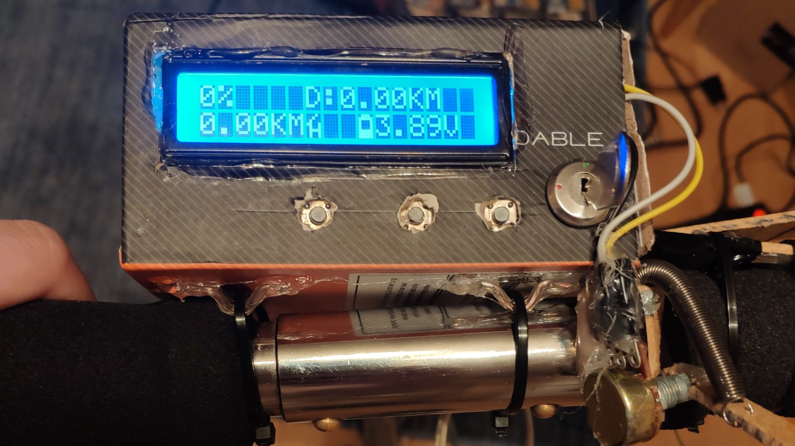
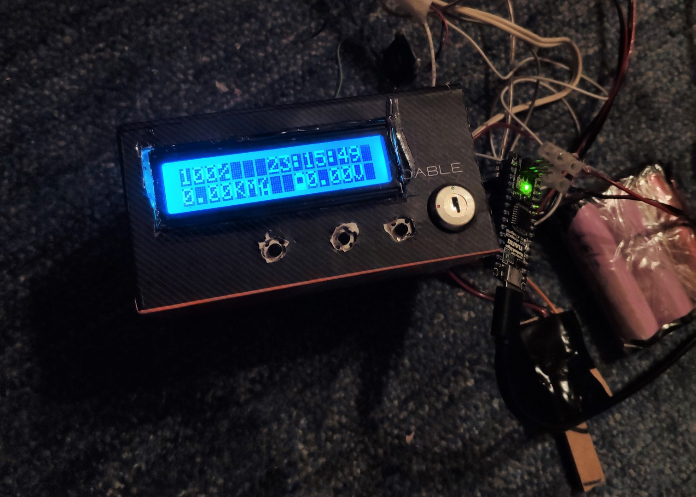
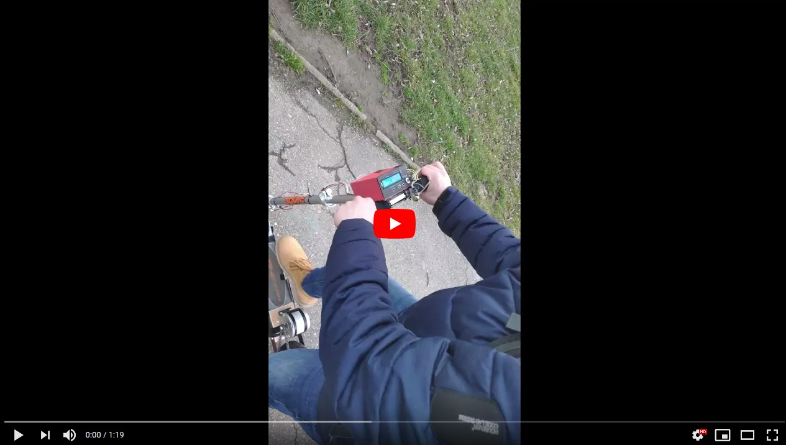

# Onboard computer for electric scooter
 Arduino based onboard computer for a homemade electric scooter (prototype).

## Table of contents
* [General info](#general-info)
* [Photos and video](#photos-and-videos)
* [Features](#features)
* [Dependencies](#dependencies)
* [Setup](#setup)
* [Status](#status)

## General info
The project of a homemade electric scooter was made just for fun and learn. It consists of two parts: mechanical/electrical(frame modyfication, a drive, power source, motor driver) and IT related. Here I am presenting the IT one. The brain of this onboard computer is an Arduino Nano board. It analyzes data from many sensors and calculates different parameters, also controls the motor (by a driver board) and shows information on a LCD display. The most essential information provided by computer are distance, speed, current time and battery voltage. More about its functionality could be found in [Features](#features) section. The electric scooter was tested on 02.2020, in general it works but there are many things which could be improved so project is still in development. For example the drive, power management needs some upgrades, also phisical brake should be added (now there is only braking by motor with simply energy retrieving implemented). Maybe in the future I will prepare an article about the whole project with many pictures, schematics and details.  

## Photos and video
Sample photos of project:

Video from the first ride, sorry for quality, it was made really spontaneously.

## Features
Key features of the onboard computer:
* Current speed (based on magnet and hall efect)
* Total distance (saved on arduino's EEPROM)
* Trip distance
* Current time (based on extra RTC module)
* Main and logic battery voltage
* Main battery temperature
* Controling motor power by potentiometer shifter
* Braking by motor and energy retrieving control
* 16x2 backlighted LCD display 
* 3 buttons for controling displayed info and backlight, in future they would be used also for other settings
* key ignition to turn on (not very secure but looks great)

## Dependencies
- [Arduino IDE](https://www.arduino.cc/en/software)
- [LCD library](https://github.com/fmalpartida/New-LiquidCrystal)
- [DS3231 - RTC library](http://www.rinkydinkelectronics.com/library.php?id=73)

## Setup
An Arduino IDE or other IDE with Arduino extension is required to use this code. Also previously mentioned libraries must be installed. Hardware pins are commented in code. More information about used hardware and schematics with connections to all modules will be given in future.

## Status
In progress, now suspended but will be continued.

